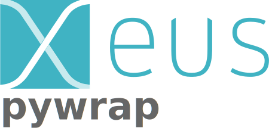

# 

[](https://github.com/DerThorsten/xeus-pywrap/actions/workflows/main.yml)

[](https://xeus-pywrapreadthedocs.io/en/latest/?badge=latest)
[](https://mybinder.org/v2/gh/DerThorsten/xeus-pywrap/main?urlpath=/lab/tree/notebooks/xeus-pywrap.ipynb)

`xeus-pywrap` is a Jupyter kernel for python based on the native implementation of the
Jupyter protocol [xeus](https://github.com/jupyter-xeus/xeus).

## Installation

xeus-pywrap has not been packaged for the mamba (or conda) package manager.

To ensure that the installation works, it is preferable to install `xeus-pywrap` in a
fresh environment. It is also needed to use a
[miniforge](https://github.com/conda-forge/miniforge#mambaforge) or
[miniconda](https://conda.io/miniconda.html) installation because with the full
[anaconda](https://www.anaconda.com/) you may have a conflict with the `zeromq` library
which is already installed in the anaconda distribution.

The safest usage is to create an environment named `xeus-pywrap`

```bash
mamba create -n  `xeus-pywrap`
source activate  `xeus-pywrap`
```

<!-- ### Installing from conda-forge

Then you can install in this environment `xeus-pywrap` and its dependencies

```bash
mamba install`xeus-pywrap` notebook -c conda-forge
``` -->

### Installing from source

Or you can install it from the sources, you will first need to install dependencies

```bash
mamba install cmake cxx-compiler xeus-zmq nlohmann_json cppzmq xtl jupyterlab -c conda-forge
```

Then you can compile the sources (replace `$CONDA_PREFIX` with a custom installation
prefix if need be)

```bash
mkdir build && cd build
cmake .. -D CMAKE_PREFIX_PATH=$CONDA_PREFIX -D CMAKE_INSTALL_PREFIX=$CONDA_PREFIX -D CMAKE_INSTALL_LIBDIR=lib
make && make install
```

<!-- ## Trying it online

To try out xeus-pywrap interactively in your web browser, just click on the binder link:
(Once Conda Package is Ready)

[](https://mybinder.org/v2/gh/DerThorsten/xeus-pywrap/main?urlpath=/lab/tree/notebooks/xeus-pywrap.ipynb) -->


## Documentation

To get started with using `xeus-pywrap`, check out the full documentation

http://xeus-pywrap.readthedocs.io


## Dependencies

`xeus-pywrap` depends on

- [xeus-zmq](https://github.com/jupyter-xeus/xeus-zmq)
- [xtl](https://github.com/xtensor-stack/xtl)
- [nlohmann_json](https://github.com/nlohmann/json)
- [cppzmq](https://github.com/zeromq/cppzmq)

## Contributing

See [CONTRIBUTING.md](./CONTRIBUTING.md) to know how to contribute and set up a
development environment.

## License

This software is licensed under the `BSD 3-Clause License`. See the [LICENSE](LICENSE)
file for details.
